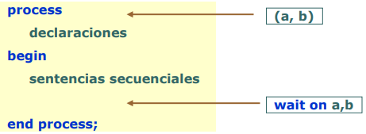

# VHDL
VHSIC (Very High Speed Integrated Circuit)  
Hardware   
Description  
Language  
  
Lenguaje de alto nivel para el modelado de circuitos, es un lenguaje orientado a procesos.
Las sentencias no siempre son ejecutadas secuencialmente. No se compila en un ejecutable sino que se sintetiza en un circuito digital. 

Admite diferentes niveles de abstracción
1. VHDL para especificación.
2. VHDL para simulación (Comportamental).
3. VHDL para síntesis (RTL y lógico).

Un diseño en VHDL cuenta con dos unidades de diseño
obligatorias
+ Entidad (ENTITY) -> Define Puestos(modo, tipo).
+ Arquitectura (ARCHITECTURE) -> Define el comportamiento interno.

```VHDL
ENTITY nombre_entidad IS
END nombre_entidad;

ARCHITECTURE nombre_arquitectura OF nombre _entidad IS
END nombre_arquitectura;
```

## PORTS (Puertos)
Ports = Canales de comunicación
+ El nombre debe de ser único dentro de la entidad.
+ Se declara una lista de propiedades como:  
    Modo: La direción del flujo de datos (Entrada, salida, bidireccional).
    Tipo: Los valores que puede tomar el puerto ('1', '0', 'Z', etc)

### Tipos
VHDL es un lenguaje fuertemente tipado. Todos los objetos poseen un tipo en la declaración. Las asignaciones sólo pueden hacerse entre objetos del mismo tipo.  
Los tipos predefinidos son:
+ Escalares: integer, floating point, enumerated
+ Compuestos: array, record
+ Punteros: access -> Sirven para simular pero no se pueden sintetizar
+ Archivos: file -> Sirven para simular pero no se pueden sintetizar

Tipo Std_logic: valor presente en un cable de 1 bit
+ Declarado en IEEE.standard_logic_1164
+ Extension a bus: Std_logic_vector


### Tipos básicos
+ BIT: sólo puede tomar valores de '0' o '1'. Para modelar señales digitales.
+ BIT_VECTOR: vector de bits. Para modelar buses.
+ INTEGER: número entero usado como valor índice en lazos, constantes o valores genéricos.
+ BOOLEAN: valor lógico TRUE o FALSE.
+ REAL: tipo de números con coma flotante.
+ ENUMERATED: enumeración. Conjunto de valores definidos por el usuario. Sirve en máquinas de estados.  
    Ej: Type estados is (inicio, lento, rápido).

### Tipo std_logic
Simula los valores que un cable puede tomar en la realidad.
+ 'U': No inicialziado (Uninitialized).
+ 'X': Desconocido (Forcing unknown).
+ '0': Bajo (Forcing low)
+ '1': Alto (Forcing high)
+ 'Z': Alta impedancia (High impedance)
+ 'W': Desconocido débil (Weak unknown)
+ 'L': Bajo débil (Weak low)
+ 'H': Alto débil (Weak High)
+ '-': No importa (Don't care)

Todos los valores son válidos en un simulador VHDL, pero solo: '1', '0', 'Z', 'L' 'H' y '-'

### Arrays
Los vectores se pueden definir tanto en rangos ascendentes como descendentes
```VHDL
signal a: bit_vector (0 to 3); -- rango ascendente
signal b: bit_vector (3 downto 0); -- rango descendente
```
Si asignamos a <= “0101”; b<=“0101”;

Produce como resultado  
a(0) = '0'; a(1) = '1'; a(2) = '0'; a(3) = '1';  
b(0) = '1'; b(1) = '0'; b(2) = '1'; b(3) = '0';

Una manera rápida de asignar valores a los vectores son los aggregates
```VHDL
a <= ( 0 => `1´, 1 => c and d, others => `Z´);
```

### Ports: Modos de un puerto
Indican la dirección y si el puerto puede leerse o escribirse dentro de la entidad
+ IN: Una señal que entra a la entidad y no sale. La señal puede ser leída pero no escrita
+ OUT: Una señal que sale de la entidad y no es usada internamente. La señal no puede ser leída dentro de la entidad
+ BUFFER: Una señal que sale de la entidad y también es realimentada dentro de la entidad. Esta señal puede ser leída
+ INOUT: Una señal que es bidireccional entrada/salida de la entidad

Nota: Una señal es como si fuera un cable.

```VHDL
LIBRARY ieee;
USE ieee.std_logic_1164.ALL
ENTITY mi_componente IS PORT (
    clk, rst : IN std_logic;
    d: IN std_logic_vector( 7 DOWNTO 0 );
    q: OUT std_logic_vector( 7 DOWNTO 0 );
    co : OUT std_logic);
END mi_componente;
```

## Estructura de un diseño VHDL
Una arquitectura en VHDL se compone de:
+ Parte declarativa.
+ Cuerpo de la arquitectura.

```VHDL
ENTITY nombre_entidad IS
END nombre_entidad;
ARCHITECTURE nombre_arquitectura OF nombre _entidad IS
    -- declaraciones de señales (signals)
    -- declaraciones de componentes
BEGIN
    -- sentencias procesos (process)
    -- sentencias concurrentes
    -- instanciación de componentes
END nombre_arquitectura;
```

## Signal (Señal)
Modela un cable, puede conectar puertos de entidades dentro de la arquitectura. Permiten comunicación entre procesos. 
Se declara en la parque declarativa de la arquitectura.  
Su asignación (<=) no es inmediata, sólo tiene efecto cuando avanza el tiempo.
```VHDL
signal idle: std_logic <= `0´;
```  
Cada señal posee una historia. Los valores pasados, presente y futuros (previstos) se almacenan en forma permanente.
```VHDL
s <= ‘1’ after 10 ns, ‘0’ after 18 ns, ‘1’ after 25 ns;
```  
Las señales poseen dos tipos de retardo: inercial (por defecto) y de transporte  
```VHDL
A1 <= B after 10 ns;
A2 <= transport B after 10 ns;
```  
  

## Operadores
+ Lógicos: and, or, not, xor y xnor
+ Relacionales: = (igual), /= (distinto), < (menor), <=(menor o igual), > (mayor) y >= (mayor o igual)
+ Adición: + (suma), - (resta) y & (concatenación de vectores)
+ Multiplicativos: * (multiplicación), / (división), rem (resto) y mod (módulo)
+ Signos (unarios): + , -
+ Desplazamiento (bit_vector): sll, srl, sla, sra, rol y ror
+ Misceláneos: abs (valor absoluto), ** (exponenciación), not (negación unario)


## Diseño concurrente en VHDL
Los métodos para describir la concurrencia dentro de una arquitectura son:  
+ Instanciaciones
+ Asignaciones concurrentes
+ Procesos. Un proceso es un conjunto de sentencias secuenciales que se ejecutan según el orden.  

El orden relativo de procesos y asignaciones concurrentes dentro de una arquitectura no es relevante.  
Las señales se utilizan para controlar la activación de los procesos.  

### Procesos
Constituidos por instrucciones que se ejecutan y evalúan secuencialmente. 
```VHDL
mux: process (a, b, sel)
begin
    if (sel=‘0’) then c<=a;
    else c<=b;
    end if;
end process;
``` 

### Sentencias concurrentes
En la arquitectura se encuentran fuera de los procesos y se evalúan concurrentemente (asignaciones concurrentes).
```VHDL
c <= b when sel=‘1’ else a;
``` 

### Instanciaciones de componentes (otras entidades).
Se evalúan concurrentemente.
```VHDL
MUX1: Mux port map (
    a =>a,
    b =>b,
    sel =>sel,
    c => c);
``` 

### Procesos: Ejecución
Semánticamente un proceso es un bucle infinito de instrucciones secuenciales. El tiempo no avanza durante la ejecución del proceso.  
¿Cómo avanza el tiempo si un proceso se activa? con la instrucción wait.
+ wait on a,b (cambio en a o b),  
+ wait for retraso (un cierto tiempo),  
+ wait until condición  

  

Lista de sensibilidad: conjunto de señales que activan el proceso cuando se produce un cambio en alguna de ellas.