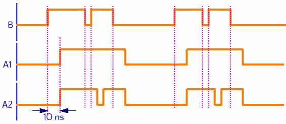
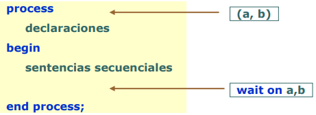
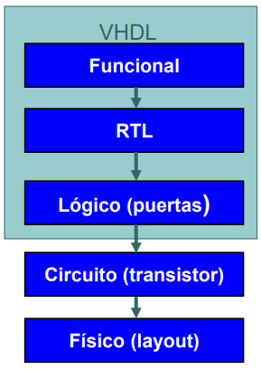
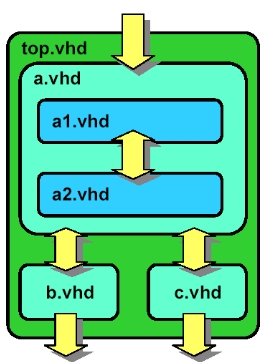

# VHDL
VHSIC (Very High Speed Integrated Circuit)  
Hardware   
Description  
Language  
  
Lenguaje de alto nivel para el modelado de circuitos, es un lenguaje orientado a procesos.
Las sentencias no siempre son ejecutadas secuencialmente. No se compila en un ejecutable sino que se sintetiza en un circuito digital. 

Admite diferentes niveles de abstracción
1. VHDL para especificación.
2. VHDL para simulación (Comportamental).
3. VHDL para síntesis (RTL y lógico).

Un diseño en VHDL cuenta con dos unidades de diseño
obligatorias
+ Entidad (ENTITY) -> Define Puestos(modo, tipo).
+ Arquitectura (ARCHITECTURE) -> Define el comportamiento interno.

```VHDL
ENTITY nombre_entidad IS
END nombre_entidad;

ARCHITECTURE nombre_arquitectura OF nombre _entidad IS
END nombre_arquitectura;
```

## PORTS (Puertos)
Ports = Canales de comunicación
+ El nombre debe de ser único dentro de la entidad.
+ Se declara una lista de propiedades como:  
    Modo: La direción del flujo de datos (Entrada, salida, bidireccional).
    Tipo: Los valores que puede tomar el puerto ('1', '0', 'Z', etc)

### Tipos
VHDL es un lenguaje fuertemente tipado. Todos los objetos poseen un tipo en la declaración. Las asignaciones sólo pueden hacerse entre objetos del mismo tipo.  
Los tipos predefinidos son:
+ Escalares: integer, floating point, enumerated
+ Compuestos: array, record
+ Punteros: access -> Sirven para simular pero no se pueden sintetizar
+ Archivos: file -> Sirven para simular pero no se pueden sintetizar

Tipo Std_logic: valor presente en un cable de 1 bit
+ Declarado en IEEE.standard_logic_1164
+ Extension a bus: Std_logic_vector


### Tipos básicos
+ BIT: sólo puede tomar valores de '0' o '1'. Para modelar señales digitales.
+ BIT_VECTOR: vector de bits. Para modelar buses.
+ INTEGER: número entero usado como valor índice en lazos, constantes o valores genéricos.
+ BOOLEAN: valor lógico TRUE o FALSE.
+ REAL: tipo de números con coma flotante.
+ ENUMERATED: enumeración. Conjunto de valores definidos por el usuario. Sirve en máquinas de estados.  
    Ej: Type estados is (inicio, lento, rápido).

### Tipo std_logic
Simula los valores que un cable puede tomar en la realidad.
+ 'U': No inicialziado (Uninitialized).
+ 'X': Desconocido (Forcing unknown).
+ '0': Bajo (Forcing low)
+ '1': Alto (Forcing high)
+ 'Z': Alta impedancia (High impedance)
+ 'W': Desconocido débil (Weak unknown)
+ 'L': Bajo débil (Weak low)
+ 'H': Alto débil (Weak High)
+ '-': No importa (Don't care)

Todos los valores son válidos en un simulador VHDL, pero solo: '1', '0', 'Z', 'L' 'H' y '-'

### Arrays
Los vectores se pueden definir tanto en rangos ascendentes como descendentes
```VHDL
signal a: bit_vector (0 to 3); -- rango ascendente
signal b: bit_vector (3 downto 0); -- rango descendente
```
Si asignamos a <= “0101”; b<=“0101”;

Produce como resultado  
a(0) = '0'; a(1) = '1'; a(2) = '0'; a(3) = '1';  
b(0) = '1'; b(1) = '0'; b(2) = '1'; b(3) = '0';

Una manera rápida de asignar valores a los vectores son los aggregates
```VHDL
a <= ( 0 => `1´, 1 => c and d, others => `Z´);
```

### Ports: Modos de un puerto
Indican la dirección y si el puerto puede leerse o escribirse dentro de la entidad
+ IN: Una señal que entra a la entidad y no sale. La señal puede ser leída pero no escrita
+ OUT: Una señal que sale de la entidad y no es usada internamente. La señal no puede ser leída dentro de la entidad
+ BUFFER: Una señal que sale de la entidad y también es realimentada dentro de la entidad. Esta señal puede ser leída
+ INOUT: Una señal que es bidireccional entrada/salida de la entidad

Nota: Una señal es como si fuera un cable.

```VHDL
LIBRARY ieee;
USE ieee.std_logic_1164.ALL
ENTITY mi_componente IS PORT (
    clk, rst : IN std_logic;
    d: IN std_logic_vector( 7 DOWNTO 0 );
    q: OUT std_logic_vector( 7 DOWNTO 0 );
    co : OUT std_logic);
END mi_componente;
```

## Estructura de un diseño VHDL
Una arquitectura en VHDL se compone de:
+ Parte declarativa.
+ Cuerpo de la arquitectura.

```VHDL
ENTITY nombre_entidad IS
END nombre_entidad;
ARCHITECTURE nombre_arquitectura OF nombre _entidad IS
    -- declaraciones de señales (signals)
    -- declaraciones de componentes
BEGIN
    -- sentencias procesos (process)
    -- sentencias concurrentes
    -- instanciación de componentes
END nombre_arquitectura;
```

## Signal (Señal)
Modela un cable, puede conectar puertos de entidades dentro de la arquitectura. Permiten comunicación entre procesos. 
Se declara en la parque declarativa de la arquitectura.  
Su asignación (<=) no es inmediata, sólo tiene efecto cuando avanza el tiempo.
```VHDL
signal idle: std_logic <= `0´;
```  
Cada señal posee una historia. Los valores pasados, presente y futuros (previstos) se almacenan en forma permanente.
```VHDL
s <= ‘1’ after 10 ns, ‘0’ after 18 ns, ‘1’ after 25 ns;
```  
Las señales poseen dos tipos de retardo: inercial (por defecto) y de transporte  
```VHDL
A1 <= B after 10 ns;
A2 <= transport B after 10 ns;
```  
  

## Operadores
+ Lógicos: and, or, not, xor y xnor
+ Relacionales: = (igual), /= (distinto), < (menor), <=(menor o igual), > (mayor) y >= (mayor o igual)
+ Adición: + (suma), - (resta) y & (concatenación de vectores)
+ Multiplicativos: * (multiplicación), / (división), rem (resto) y mod (módulo)
+ Signos (unarios): + , -
+ Desplazamiento (bit_vector): sll, srl, sla, sra, rol y ror
+ Misceláneos: abs (valor absoluto), ** (exponenciación), not (negación unario)


## Diseño concurrente en VHDL
Los métodos para describir la concurrencia dentro de una arquitectura son:  
+ Instanciaciones
+ Asignaciones concurrentes
+ Procesos. Un proceso es un conjunto de sentencias secuenciales que se ejecutan según el orden.  

El orden relativo de procesos y asignaciones concurrentes dentro de una arquitectura no es relevante.  
Las señales se utilizan para controlar la activación de los procesos.  

### Procesos
Constituidos por instrucciones que se ejecutan y evalúan secuencialmente. 
```VHDL
mux: process (a, b, sel)
begin
    if (sel=‘0’) then c<=a;
    else c<=b;
    end if;
end process;
``` 

### Sentencias concurrentes
En la arquitectura se encuentran fuera de los procesos y se evalúan concurrentemente (asignaciones concurrentes).
```VHDL
c <= b when sel=‘1’ else a;
``` 

### Instanciaciones de componentes (otras entidades).
Se evalúan concurrentemente.
```VHDL
MUX1: Mux port map (
    a =>a,
    b =>b,
    sel =>sel,
    c => c);
``` 

### Procesos: Ejecución
Semánticamente un proceso es un bucle infinito de instrucciones secuenciales. El tiempo no avanza durante la ejecución del proceso.  
¿Cómo avanza el tiempo si un proceso se activa? con la instrucción wait.
+ wait on a,b (cambio en a o b),  
+ wait for retraso (un cierto tiempo),  
+ wait until condición  

  

Lista de sensibilidad: conjunto de señales que activan el proceso cuando se produce un cambio en alguna de ellas.

+ Proceso Explícitos: La lista de sensibilidad se declara explícitamente.
    + Procesos
+ Procesos implícitos: La lista de sensibilidad se obtiene de la propia expresión:  
    + Asignaciones concurrentes.
    + Instanciación de componentes.

```VHDL
libary ieee;
use ieee.std_logic_1164.all;
entity simple is
    port (a,b,c,d : in std_logic;
    z: out std_logic);
end simple;
architecture logica of simple is
signal x, y : std_logic;  --Declaración de señales
begin
    z <= x or y;  --Todos estos son procesos implícitos
    x <= a and b;
    y <= c xor d;
end logica;
``` 
El orden en la declaración de los procesos no infiere en su ejecución.   

### Instrucciones concurrentes
```VHDL
    z <= x or y;  --Todos estos son procesos implícitos
    x <= a and b;
    y <= c xor d;
    k <= (a and not sel) or (b and sel);
    h <= a when sel=‘0’ else b;
``` 
Una instrucción se ejecuta cuando cambia una de sus entradas.  
La asignación de los nuevos valores se realiza una vez ejecutadas todas las instrucciones cuyas entradas han cambiado. Si como consecuencia del nuevo valor cambia alguna de las entradas de otra instrucción, se ejecuta dicha instrucción

### Instrucciones secuenciales
```VHDL
process (selc, selb, a, b, c)
begin
    if (selc = ‘1’) then
        x <= c;
    elsif (selb = ‘1’) then
        x <= b;
    else
        x <= a;
    end if;
end process;
``` 
```VHDL
process (sel, a, b, c, d)
begin
    case sel is
    when “00” =>
        x <= a;
    when “01” =>
        x <= b;
    when “10” =>
        x <= c;
    when others =>
        x <= d;
    end case;
end process;
``` 
Las sentencias dentro de un proceso son evaluadas secuencialmente. Un proceso puede estar activo o inactivo. Típicamente un proceso posee una lista de sensibilidad: El proceso
pasa a estar activo cuando cambia un valor de esta lista. También puede tener una o varias sentencias wait, que hacen que el proceso pase a inactivo. El tiempo avanza cuando el proceso pasa a inactivo.


### Bucles secuenciales: LOOP
Bucle infinito con condición  
```VHDL
while <condición> loop
    --sentencias secuenciales
end loop;
```
Bucle for iterativo  
```VHDL
for <identificador> in <rango> loop
    --sentencias secuenciales
end loop;
```

## Variables
Almacenamiento local de un dato temporal.
+ Pueden ser de los mismos tipos de una señal (signal).
+ Visible solo en el interior de un proceso.
+ Se declara en el proceso.
+ Su asignación ( := ) es inmediata.
```VHDL
variable idle: std_logic := `0´;
```
```VHDL
architecture comp of mux2latch is
begin
    mux: process (a, b, sel)
    variable c : std_logic;
    begin
        if (sel=‘0’) then c:=a; -- inmediato
        else c:=b;
        end if;
        x <=(x and (not en)) or (c and en);
    end process;
end comp;
```
Constante es una asociación de un nombre a un determinado valor  
```VHDL
constant pi: real := 3.1416
```
### Señales Vs. Variables
|                 | Señales                    | Variables                        |
|---------------|---------------------------|--------------------------------|
| **Sintaxis**  | `destino <= fuente`       | `destino := fuente`           |
| **Utilidad**  | modelan nodos físicos del circuito | representan almacenamiento local |
| **Visibilidad** | global (comunicación entre procesos) | local (dentro de proceso) |
| **Comportamiento** | se actualizan cuando avanza el tiempo (se suspende el proceso) | se actualizan inmediatamente |

### Asignación de señales en buses
```VHDL
signal tmp: std_logic_vector(7 downto 0);
--Todos los bits 
    tmp <= “10100011”;
    tmp <= x”A3”; -- VHDL 93
--Un solo bit
    tmp(7) <= '1';
--Un rango de bits 
    tmp(3 downto 0) <= “0011”;
```
```VHDL
y <= others => '0';
y <= ('0', '1', a xor b, a and b);
y <= (3 => a xor b, 1 =>'1', 2 => '0', a and b);
y <= y(2 dowto 0) &'0';
```

## Niveles de abstracción
1. Funcional o Comportamental:
    + Conjunto de instrucciones secuenciales.
    + No se detallan relojes o retrasos.
    + No siempre es sintetizable.
2. RTL (Register Transfer Level):
    + Es la entrada para la síntesis.
    + Las operaciones se realizan en un ciclo de reloj especifico.
    + No se detallan retrasos.
3. Lógico o de puertas:
    + Es la salida de la síntesis.
    + Expresado en término de ecuaciones lógicas o puertas y elementos de una biblioteca (genérica o específica).
    + Se incluye información de retraso para cada puerta. 

  

### RTL: Register Transfer Level
Flujo de datos entre registros y bloques funcionales. Tienen en cuenta el ciclo de reloj. Independiente de la tecnología.  
Definición del sistema en términos de:
+ registros, lógica combinacional y operaciones.

---
## Circuitos básicos: Multiplexores
### Por asignación concurrente:
Simple:
```VHDL
x <= (a and not sel) or (b and sel);
```
Condicional:
```VHDL
x <= a when sel='0' else
    b;
```
Por selección:
```VHDL
with sel select
x <= a when sel='0',
    b when sel='1',
    '0' when others;
```
### Por asignación secuencial dentro de procesos:
Usando sentencias secuenciales: if-then-else.
```VHDL
process (selc, selb, a, b, c)
begin
    if (selc = ‘1’) then
        x <= c;
    elsif (selb = ‘1’) then
        x <= b;
    else
        x <= a;
    end if;
end process;
```
Usando sentencias secuenciales: case.
```VHDL
process (sel, a, b, c, d)
begin
    case sel is
        when “00” =>
            x <= a;
        when “01” =>
            x <= b;
        when “10” =>
            x <= c;
        when others =>
            x <= d;
    end case;
end process;
```
## Circuitos básicos: Registros
Existen dos métodos para crear flip-flops:
- Instanciación del componente flip-flop desde una librería.
- Utilizar un proceso sensible al flanco de reloj.

### Instanciación de componentes
```VHDL
libary ieee;
use ieee.std_logic_1164.all;
entity ffd is
    port (d, clk : in std_logic;
    q: out std_logic);
end ffd;
use ieee.rtlpkg.all;
architecture instffd of ffd is
begin
    flipflop: dff port map (d,clk,q);
    -- componente dff definido en rtlpkg
end instffd;
--Ejemplo flip-flop D
```

### Proceso sensible al flanco de reloj
```VHDL
libary ieee;
use ieee.std_logic_1164.all;
entity ffd is
    port (d, clk : in std_logic;
    q: out std_logic);
end ffd;
architecture compffd of ffd is
begin
    flipflop: process (clk)
    begin
        if (clk'event and clk='1') then
            q <= d;
        end if;
    end process;
end compffd;
--Ejemplo flip-flop D
```

El sintetizador infiere que debe crear registro para la señal q basándose en:
- El elemento es únicamente sensible a la señal de reloj clock.
- La expresión clock'event and clock='1' implica que la asignación de la señal se realiza en el flanco de subida de reloj.
- Se sintetiza un elemento síncrono.
- La especificación incompleta de la sentencia IF-THEN por faltar la cláusula ELSE implica que si la condición clock'event and clock='1' no se satisface (no hay flanco de subida), q debe mantener su valor hasta la siguiente asignación (memoria implícita).

### Ejemplos básicos de codificación
Flip Flop D con set asíncrono
```VHDL
ff_SA: process (clk, st)
begin
    if (st='1') then
        output <= others => '1';
    elsif (clk'event and clk='1') then
        output <= input;
    end if;
end process;
```
Flip Flop D con reset síncrono
```VHDL
ff_RS: process (clk)
begin
    if (clk'event and clk='1') then
        if (rst= '1') then
            output <= others => '0';
        else
            output <= input;
        end if;
    end if;
end process;
```
Flip Flop D con reset asíncrono
```VHDL
ff_SA: process (clk, rst)
begin
    if (rst='1') then
        output <= others => '0';
    elsif (clk'event and clk='1') then
        output <= input;
    end if;
end process;
```
Contadores
```VHDL
PCont: process (clk, rst)
begin
    if (rst='1') then
        cont <= (others => '0');
    elsif (clk'event and clk='1') then
        cont <= cont + 1;
    end if;
end process;
```

## Ejemplos de inferencia de buffer triestado
Con asignación condicional
```VHDL
a_out <= a when enable_a='1' else 'Z';
b_out <= b when enable_b='1' else 'Z';
```
Con un proceso
```VHDL
process (enable_a, a_out)
begin
    if (enable_a = ‘0’) then
        a_out <= a;
    else a_out <= ‘Z’;
end process;
```

## Diseño jerárquico
Componentes pequeños son utilizados por otros más grandes
- Es fundamental para la reutilización de código
- Permite mezclar componentes creados con distintos métodos de diseño: VHDL, Verilog, esquemáticos
- Genera diseños más legibles y más portables
- Necesario para estrategias de diseño top-down o botton-up

   


## Testbench
Un diseño sin verificación no está completo:
- Existen muchas maneras de verificar, la más utilizada es el banco de pruebas: TestBench
- Simular básicamente es:
    - Generar estímulos
    - Observar resultados
- Un TestBench es un código VHDL que automatiza estas dos operaciones
- Los TestBenches no se sintetizan

